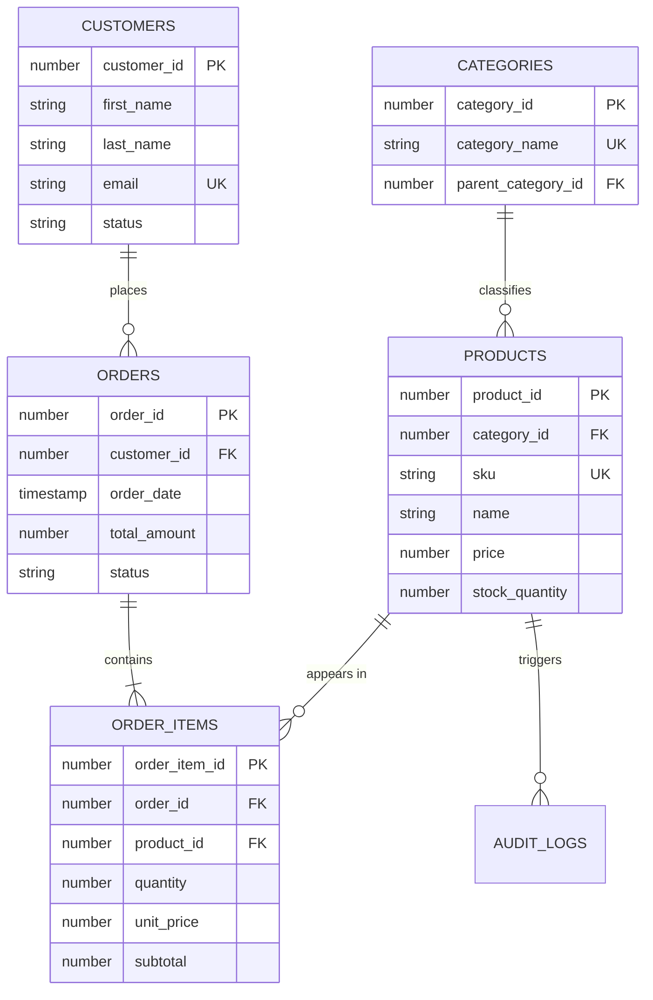

# 🛍️ Qorvae Commerce — Online Shopping Database System
### Enterprise Full-Stack E-Commerce Platform Powered by Oracle Database 21c XE

[](https://www.oracle.com/database/)
[](https://nodejs.org/)
[](https://expressjs.com/)
[](https://react.dev/)
[](https://tailwindcss.com/)

---

## 📌 Project Overview

**Qorvae Commerce** is a production-grade full-stack e-commerce database management system designed and engineered to showcase advanced relational database architecture and **Oracle DBA administration**. 

The system features real-time catalog browsing, stock reservation with pessimistic row-level locking, atomic order transactions, customer purchasing history analytics, and a live DBA operational telemetry console.

---

## 🏗️ System Architecture

```text
+-------------------------------------------------------------------------------+
|                             FULL-STACK ARCHITECTURE                           |
+-------------------------------------------------------------------------------+

  [ React 18 Client (Port 5000) ]
        |
        |  REST API Requests (JSON)
        v
  [ Node.js / Express Backend ]
        |
        |  node-oracledb (Thin Mode over TCP Port 1521)
        v
  [ Oracle Database 21c XE (PDB: XEPDB1) ]
        |
        +---> TS_ECOMM_DATA (Tables: CUSTOMERS, PRODUCTS, ORDERS, ORDER_ITEMS)
        |
        +---> TS_ECOMM_IDX  (B-Tree Indexes for High-Speed Lookups)
        |
        +---> PL/SQL Packages & Views (VW_CUSTOMER_ORDER_HISTORY, PKG_ECOMMERCE_ORDERS)
```

---

## 💎 Key Features

### 1. Storefront & Real-Time Catalog
* Category filters, instant SKU/name search, low-stock reorder indicators.
* Live inventory synchronization directly connected to Oracle Database 21c.

### 2. ACID Atomic Checkout & Stock Reservation
* **Pessimistic Row-Level Locking** (`SELECT stock_quantity FROM products WHERE product_id = :id FOR UPDATE`) guarantees zero overselling during concurrent purchases.
* Multi-item order placement wrapped within atomic database transactions with commit/rollback integrity.

### 3. Customer Order History Dashboard
* Core hackathon feature powered by the high-performance Oracle view **`VW_CUSTOMER_ORDER_HISTORY`**.
* Itemized receipts, historical unit prices, lifetime spend calculations, and order metrics.

### 4. Oracle DBA Command Center
* **Tablespace Telemetry**: Real-time storage gauges monitoring `TS_ECOMM_DATA` and `TS_ECOMM_IDX`.
* **Execution Plan Visualizer**: Live `DBMS_XPLAN` query analyzer validating Cost-Based Optimizer (CBO) performance.
* **B-Tree Index Coverage**: Live monitoring of index health and uniqueness across foreign keys.
* **SQL Query Console**: Read-only query console to inspect dictionary objects and schema rows.

---

## 📊 Relational Database Design (3NF)



---

## 🚀 Quick Start Guide

### Prerequisites
* **Oracle Database 21c XE** installed and running on `localhost:1521/XEPDB1`
* **Node.js** (v18 or higher) & **npm**

### 1. Database Provisioning
Run the SQL scripts located in [`database/`](database/):
```sql
-- Connect as SYSDBA
@database/01_tablespaces_and_user.sql
-- Connect as ECOMMERCE_DBA / Ecommerce123
@database/02_schema.sql
@database/03_seed_data.sql
@database/04_views_and_procedures.sql
```

### 2. Environment Configuration
Create a `.env` file in the root directory:
```env
ORACLE_USER=ECOMMERCE_DBA
ORACLE_PASSWORD=Ecommerce123
ORACLE_CONNECT_STRING=localhost:1521/XEPDB1
PORT=5000
```

### 3. Install Dependencies & Build Frontend
```bash
# Install root, backend, and frontend packages
npm run install-all

# Compile the React production build
npm run build
```

### 4. Start the Application
```bash
npm start
```
Open your browser and navigate to:
```text
http://localhost:5000
```

---

## 📁 Repository Structure

```text
online-shopping-dba/
├── client/                     # React 18 Single-Page Application (Vite + Tailwind CSS)
│   ├── src/
│   │   ├── components/         # Catalog, OrderHistory, CartModal, OrdersManager, DbaConsole
│   │   ├── App.jsx             # Main application layout
│   └── dist/                   # Production build output
├── server/                     # Node.js Express REST API
│   ├── src/
│   │   ├── config/database.js  # Oracle connection pool (node-oracledb Thin Mode)
│   │   ├── routes/             # REST endpoints (catalog, orders, dba telemetry)
│   │   └── index.js            # Express server entry point
├── database/                   # Oracle SQL and PL/SQL scripts
│   ├── 01_tablespaces_and_user.sql
│   ├── 02_schema.sql
│   ├── 03_seed_data.sql
│   ├── 04_views_and_procedures.sql
│   └── 05_dba_queries.sql
├── docs/                       # Project reports and documentation
└── package.json                # Project dependencies and startup scripts
```

---

## 🎓 Academic Submission Details

* **Project**: Online Shopping Database (E-Commerce Management System)
* **Student Name**: Ridhumiga J
* **Register Number**: 2428C0573
* **Department**: Artificial Intelligence & Machine Learning (AIML)
* **Institution**: St. Joseph's College for Women, Tiruppur
* **Partner / Program**: Tamil Nadu Skill Development Corporation (TNSkill) • AdroIT Technologies • Oracle

---

## 📜 License
This project is open-source under the [MIT License](LICENSE).
