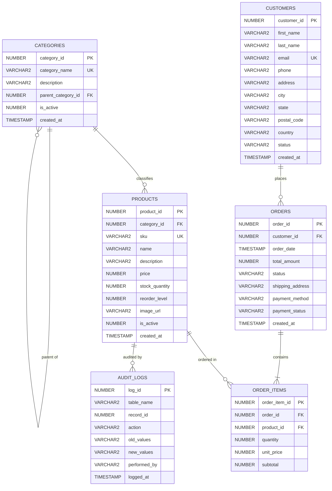

# Online Shopping Database (E-Commerce Management System)
## Oracle DBA Hackathon Project Report

---

### Student Details
- **Student Name**: [Your Name / e.g. Sriram]
- **Register Number**: [Your Register Number]
- **Department**: Computer Science & Engineering / AIML / Information Technology
- **ID**: [Your Student ID]
- **College**: [Your College Name]
- **Date of Submission**: September 23, 2026
- **GitHub Repo Link**: [Your Repository URL]
- **Deployment Link**: http://localhost:5000

---

## Problem Statement

An online retail business requires a robust and scalable relational database system to manage customer profiles, product catalogs, order transactions, and line items. Managing high volumes of e-commerce transactions manually or via spreadsheets leads to inventory discrepancies, duplicate orders, lack of customer order history tracking, and security vulnerabilities.

The **Online Shopping Database (E-Commerce System)** is designed to organize and automate this workflow using an enterprise relational database (Oracle Database 21c XE). The database systematically stores customer profiles, product categories, physical products with real-time stock levels, purchase orders, and itemized receipts, while establishing strict relational constraints and indexing strategies. Advanced SQL queries, views (`VW_CUSTOMER_ORDER_HISTORY`), and PL/SQL packages are implemented to guarantee ACID transaction properties and provide immediate access to customer purchasing patterns.

---

## Real-World Scenario

Consider a customer visiting an online shopping portal to buy computing hardware and technical accessories.
1. The **Customer** represents the shopper registered with their contact information and shipping address.
2. The **Product Category** groups related goods into classifications (e.g., Computing, Audio, Electronics).
3. The **Product** represents the inventory item available for purchase, tracking SKU, price, and physical warehouse stock.
4. The **Order** represents the high-level financial transaction created when the customer checks out.
5. The **Order Item** represents the specific quantity and snapshot unit price of each individual product included in that order.

The entity relationship can be represented as:
```text
CUSTOMER
   ↓ places
 ORDERS
   ↓ contains
ORDER_ITEMS
   ↓ references
PRODUCTS
   ↓ classified by
CATEGORIES
```

### Concrete Example Walkthrough:
1. **Customer**:
   - Customer ID: `1`
   - Customer Name: `Alexander Wright`
   - Email: `alex.wright@oraclecloud.com`
   - Address: `400 Oracle Parkway, Suite 1200, Redwood City, CA 94065`
   - Status: `ACTIVE`
2. **Category**:
   - Category ID: `2`
   - Category Name: `Computing`
   - Description: `Laptops, desktops, monitors, and workstation components`
3. **Product**:
   - Product ID: `1`
   - Category ID: `2`
   - SKU: `PROD-LAP-001`
   - Product Name: `Apex Pro 16" Creator Laptop`
   - Price: `$2,499.99`
   - Stock Quantity: `24`
4. **Order**:
   - Order ID: `101`
   - Customer ID: `1`
   - Order Date: `2026-09-09`
   - Order Status: `DELIVERED`
   - Total Amount: `$3,298.99`
   - Payment Method: `CREDIT_CARD`
5. **Order Items**:
   - Line Item 1: Product ID `1` (`Apex Pro Laptop`) | Qty: `1` | Unit Price: `$2,499.99` | Subtotal: `$2,499.99`
   - Line Item 2: Product ID `2` (`UltraVision Monitor`) | Qty: `1` | Unit Price: `$799.00` | Subtotal: `$799.00`

This business scenario is mapped into a relational schema consisting of `CATEGORIES`, `CUSTOMERS`, `PRODUCTS`, `ORDERS`, and `ORDER_ITEMS`.

---

## Objectives

The main objectives of the project are:
1. To design a normalized relational database (3NF / BCNF) for an online shopping system.
2. To create and manage tables using Oracle Database 21c (PDB `XEPDB1`) and standard SQL syntax.
3. To establish parent-child relationships and associative entities (`ORDER_ITEMS`) connecting orders to products.
4. To apply primary keys (`IDENTITY`), foreign keys, `UNIQUE`, `NOT NULL`, and `CHECK` constraints (e.g. `price >= 0`, `stock_quantity >= 0`).
5. To develop an optimized reporting view (`VW_CUSTOMER_ORDER_HISTORY`) fulfilling the core hackathon requirement.
6. To implement ACID transaction controls and inventory reservation via PL/SQL and row-level locking (`SELECT ... FOR UPDATE`).
7. To execute data manipulation, filtering, sorting, aggregations, grouping, and multi-table joins using SQL.
8. To integrate the database with a modern full-stack web application (Node.js/Express backend + React 18 UI).

---

## Database Design – 10 Marks

### Database Structure
The Online Shopping Database is structured around six core tables: `CATEGORIES`, `CUSTOMERS`, `PRODUCTS`, `ORDERS`, `ORDER_ITEMS`, and `AUDIT_LOGS`. 

The tables are interconnected using primary keys and foreign keys to preserve referential integrity:
- `CUSTOMERS` $\rightarrow$ `ORDERS` ($1:M$)
- `ORDERS` $\rightarrow$ `ORDER_ITEMS` ($1:M$)
- `PRODUCTS` $\rightarrow$ `ORDER_ITEMS` ($1:M$)
- `CATEGORIES` $\rightarrow$ `PRODUCTS` ($1:M$)
- `CATEGORIES` $\rightarrow$ `CATEGORIES` ($1:M$ self-referencing hierarchy)

### Tables Used

| Table Name | Purpose |
|---|---|
| `CATEGORIES` | Stores product classification categories and subcategory hierarchies |
| `CUSTOMERS` | Stores customer identity, contact information, and shipping addresses |
| `PRODUCTS` | Stores physical product catalog, SKUs, sales prices, and live stock levels |
| `ORDERS` | Tracks financial transactions, order timestamps, and fulfillment statuses |
| `ORDER_ITEMS` | Associative table storing individual line items, quantities, and prices per order |
| `AUDIT_LOGS` | Change Data Capture (CDC) table recording DBA audit trails on inventory updates |

### Entity Relationship Diagram (ERD)



### Technologies Used

| Technology / Tool | Purpose |
|---|---|
| **Oracle Database 21c XE** | Relational database management system (Enterprise PDB: `XEPDB1`) |
| **Oracle SQL\*Plus** | Command-line tool for DDL/DML execution and DBA diagnostics |
| **SQL** | Schema creation, constraint definition, data manipulation, and querying |
| **Node.js & Express** | REST API backend and connection pool management |
| **`node-oracledb` (Thin Mode)** | High-performance native driver connecting to Oracle via TCP port 1521 |
| **React 18 & Vite** | Interactive frontend user interface and DBA console dashboard |
| **Tailwind CSS & Lucide Icons** | Responsive UI styling and design components |

---

## Practical Implementation

### Database and Table Creation
The database was deployed on Oracle Database 21c XE under the dedicated schema `ECOMMERCE_DBA` in pluggable database `XEPDB1`. Tables were created in strict dependency order to guarantee foreign-key referential integrity.

#### 1. Schema & Tablespaces Provisioning
```sql
ALTER SESSION SET CONTAINER = XEPDB1;

-- Dedicated Tablespaces (I/O Segregation)
CREATE TABLESPACE TS_ECOMM_DATA DATAFILE 'ecommerce_data01.dbf' SIZE 50M AUTOEXTEND ON NEXT 10M;
CREATE TABLESPACE TS_ECOMM_IDX  DATAFILE 'ecommerce_idx01.dbf'  SIZE 30M AUTOEXTEND ON NEXT 5M;

-- Dedicated User / Schema
CREATE USER ECOMMERCE_DBA IDENTIFIED BY Ecommerce123
    DEFAULT TABLESPACE TS_ECOMM_DATA
    QUOTA UNLIMITED ON TS_ECOMM_DATA
    QUOTA UNLIMITED ON TS_ECOMM_IDX;

GRANT CONNECT, RESOURCE, CREATE VIEW, CREATE PROCEDURE, CREATE TRIGGER TO ECOMMERCE_DBA;
```

#### 2. Categories Table Creation
```sql
CREATE TABLE categories (
    category_id         NUMBER GENERATED BY DEFAULT AS IDENTITY PRIMARY KEY,
    category_name       VARCHAR2(100) NOT NULL CONSTRAINT uk_category_name UNIQUE,
    description         VARCHAR2(500),
    parent_category_id  NUMBER CONSTRAINT fk_cat_parent REFERENCES categories(category_id) ON DELETE SET NULL,
    is_active           NUMBER(1) DEFAULT 1 NOT NULL CONSTRAINT chk_cat_active CHECK (is_active IN (0, 1)),
    created_at          TIMESTAMP DEFAULT SYSTIMESTAMP NOT NULL
);
```

#### 3. Customers Table Creation
```sql
CREATE TABLE customers (
    customer_id         NUMBER GENERATED BY DEFAULT AS IDENTITY PRIMARY KEY,
    first_name          VARCHAR2(60) NOT NULL,
    last_name           VARCHAR2(60) NOT NULL,
    email               VARCHAR2(150) NOT NULL CONSTRAINT uk_cust_email UNIQUE,
    phone               VARCHAR2(25),
    address             VARCHAR2(250) NOT NULL,
    city                VARCHAR2(100) NOT NULL,
    state               VARCHAR2(100) NOT NULL,
    postal_code         VARCHAR2(20) NOT NULL,
    country             VARCHAR2(60) DEFAULT 'USA' NOT NULL,
    status              VARCHAR2(20) DEFAULT 'ACTIVE' NOT NULL 
                        CONSTRAINT chk_cust_status CHECK (status IN ('ACTIVE', 'SUSPENDED', 'INACTIVE')),
    created_at          TIMESTAMP DEFAULT SYSTIMESTAMP NOT NULL
);
```

#### 4. Products Table Creation
```sql
CREATE TABLE products (
    product_id          NUMBER GENERATED BY DEFAULT AS IDENTITY PRIMARY KEY,
    category_id         NUMBER NOT NULL CONSTRAINT fk_prod_category REFERENCES categories(category_id),
    sku                 VARCHAR2(50) NOT NULL CONSTRAINT uk_prod_sku UNIQUE,
    name                VARCHAR2(160) NOT NULL,
    description         VARCHAR2(1000),
    price               NUMBER(10, 2) NOT NULL CONSTRAINT chk_prod_price CHECK (price >= 0),
    stock_quantity      NUMBER(8) DEFAULT 0 NOT NULL CONSTRAINT chk_prod_stock CHECK (stock_quantity >= 0),
    reorder_level       NUMBER(6) DEFAULT 5 NOT NULL CONSTRAINT chk_prod_reorder CHECK (reorder_level >= 0),
    image_url           VARCHAR2(400),
    is_active           NUMBER(1) DEFAULT 1 NOT NULL CONSTRAINT chk_prod_active CHECK (is_active IN (0, 1)),
    created_at          TIMESTAMP DEFAULT SYSTIMESTAMP NOT NULL
);
```

#### 5. Orders Table Creation
```sql
CREATE TABLE orders (
    order_id            NUMBER GENERATED BY DEFAULT AS IDENTITY PRIMARY KEY,
    customer_id         NUMBER NOT NULL CONSTRAINT fk_orders_customer REFERENCES customers(customer_id),
    order_date          TIMESTAMP DEFAULT SYSTIMESTAMP NOT NULL,
    total_amount        NUMBER(12, 2) DEFAULT 0.00 NOT NULL CONSTRAINT chk_order_total CHECK (total_amount >= 0),
    status              VARCHAR2(25) DEFAULT 'PENDING' NOT NULL 
                        CONSTRAINT chk_order_status CHECK (status IN ('PENDING', 'PROCESSING', 'SHIPPED', 'DELIVERED', 'CANCELLED')),
    shipping_address    VARCHAR2(350) NOT NULL,
    payment_method      VARCHAR2(30) DEFAULT 'CREDIT_CARD' NOT NULL 
                        CONSTRAINT chk_order_pmethod CHECK (payment_method IN ('CREDIT_CARD', 'DEBIT_CARD', 'PAYPAL', 'NET_BANKING', 'COD')),
    payment_status      VARCHAR2(20) DEFAULT 'PENDING' NOT NULL 
                        CONSTRAINT chk_order_pstatus CHECK (payment_status IN ('PENDING', 'PAID', 'FAILED', 'REFUNDED')),
    created_at          TIMESTAMP DEFAULT SYSTIMESTAMP NOT NULL
);
```

#### 6. Order_Items Table Creation
```sql
CREATE TABLE order_items (
    order_item_id       NUMBER GENERATED BY DEFAULT AS IDENTITY PRIMARY KEY,
    order_id            NUMBER NOT NULL CONSTRAINT fk_item_order REFERENCES orders(order_id) ON DELETE CASCADE,
    product_id          NUMBER NOT NULL CONSTRAINT fk_item_product REFERENCES products(product_id),
    quantity            NUMBER(6) NOT NULL CONSTRAINT chk_item_qty CHECK (quantity > 0),
    unit_price          NUMBER(10, 2) NOT NULL CONSTRAINT chk_item_price CHECK (unit_price >= 0),
    subtotal            NUMBER(12, 2) NOT NULL CONSTRAINT chk_item_subtotal CHECK (subtotal >= 0)
);
```

### Implementation Summary
```text
ECOMMERCE_DBA (Oracle PDB: XEPDB1)
    │
    ├── CATEGORIES
    │      PK: category_id
    │      FK: parent_category_id → CATEGORIES(category_id)
    │
    ├── CUSTOMERS
    │      PK: customer_id
    │
    ├── PRODUCTS
    │      PK: product_id
    │      FK: category_id → CATEGORIES(category_id)
    │
    ├── ORDERS
    │      PK: order_id
    │      FK: customer_id → CUSTOMERS(customer_id)
    │
    └── ORDER_ITEMS
           PK: order_item_id
           FK: order_id   → ORDERS(order_id)
           FK: product_id → PRODUCTS(product_id)
```

### Constraints and Relationships

| Table | Primary Key | Foreign Key | Other Constraints |
|---|---|---|---|
| **`CATEGORIES`** | `category_id` | `parent_category_id` $\rightarrow$ `CATEGORIES(category_id)` | `category_name NOT NULL UNIQUE`, `is_active CHECK (0, 1)` |
| **`CUSTOMERS`** | `customer_id` | — | `first_name NOT NULL`, `last_name NOT NULL`, `email NOT NULL UNIQUE`, `status CHECK ('ACTIVE', 'SUSPENDED', 'INACTIVE')` |
| **`PRODUCTS`** | `product_id` | `category_id` $\rightarrow$ `CATEGORIES(category_id)` | `sku NOT NULL UNIQUE`, `name NOT NULL`, `price CHECK (>= 0)`, `stock_quantity CHECK (>= 0)`, `is_active CHECK (0, 1)` |
| **`ORDERS`** | `order_id` | `customer_id` $\rightarrow$ `CUSTOMERS(customer_id)` | `order_date NOT NULL`, `total_amount CHECK (>= 0)`, `status CHECK ('PENDING', 'PROCESSING', 'SHIPPED', 'DELIVERED', 'CANCELLED')` |
| **`ORDER_ITEMS`** | `order_item_id` | `order_id` $\rightarrow$ `ORDERS(order_id)`, `product_id` $\rightarrow$ `PRODUCTS(product_id)` | `quantity CHECK (> 0)`, `unit_price CHECK (>= 0)`, `subtotal CHECK (>= 0)`, `ON DELETE CASCADE` on parent order |

---

## Data Insertion

The following SQL statements insert representative e-commerce data:

### 1. Categories Data
```sql
INSERT INTO categories (category_id, category_name, description, parent_category_id, is_active)
VALUES (1, 'Electronics', 'Consumer electronics, gadgets, and cutting-edge devices', NULL, 1);

INSERT INTO categories (category_id, category_name, description, parent_category_id, is_active)
VALUES (2, 'Computing', 'Laptops, desktops, monitors, and workstation components', 1, 1);

INSERT INTO categories (category_id, category_name, description, parent_category_id, is_active)
VALUES (3, 'Audio and Wearables', 'Headphones, smartwatches, and wireless audio equipment', 1, 1);

INSERT INTO categories (category_id, category_name, description, parent_category_id, is_active)
VALUES (4, 'Home and Office', 'Ergonomic furniture, smart home automation, and accessories', NULL, 1);

INSERT INTO categories (category_id, category_name, description, parent_category_id, is_active)
VALUES (5, 'Books and Media', 'Technical literature, database administration guides, and novels', NULL, 1);
```

### 2. Customer Data
```sql
INSERT INTO customers (customer_id, first_name, last_name, email, phone, address, city, state, postal_code, country, status)
VALUES (1, 'Alexander', 'Wright', 'alex.wright@oraclecloud.com', '+1-415-555-0101', '400 Oracle Parkway, Suite 1200', 'Redwood City', 'CA', '94065', 'USA', 'ACTIVE');

INSERT INTO customers (customer_id, first_name, last_name, email, phone, address, city, state, postal_code, country, status)
VALUES (2, 'Samantha', 'Miller', 'sam.miller@techcorp.io', '+1-206-555-0142', '742 Evergreen Terrace', 'Seattle', 'WA', '98101', 'USA', 'ACTIVE');

INSERT INTO customers (customer_id, first_name, last_name, email, phone, address, city, state, postal_code, country, status)
VALUES (3, 'Devon', 'Chen', 'devon.chen@dataforge.net', '+1-512-555-0189', '1100 Silicon Hills Blvd', 'Austin', 'TX', '78701', 'USA', 'ACTIVE');

INSERT INTO customers (customer_id, first_name, last_name, email, phone, address, city, state, postal_code, country, status)
VALUES (4, 'Priya', 'Sharma', 'priya.sharma@cyberinfra.in', '+91-98200-12345', 'Plot 42, Hitec City Phase 2', 'Hyderabad', 'TS', '500081', 'India', 'ACTIVE');
```

### 3. Products Data
```sql
INSERT INTO products (product_id, category_id, sku, name, description, price, stock_quantity, reorder_level, image_url, is_active)
VALUES (1, 2, 'PROD-LAP-001', 'Apex Pro 16" Creator Laptop', 'M3 Max 36GB RAM, 1TB NVMe PCIe 4.0 SSD, Liquid Retina XDR display', 2499.99, 24, 5, 'https://images.unsplash.com/photo-1517336714731-489689fd1ca8?w=500', 1);

INSERT INTO products (product_id, category_id, sku, name, description, price, stock_quantity, reorder_level, image_url, is_active)
VALUES (2, 2, 'PROD-MON-002', 'UltraVision 34" Curved 4K Monitor', '144Hz IPS Ultrawide with 90W USB-C Power Delivery and built-in KVM switch', 799.50, 18, 4, 'https://images.unsplash.com/photo-1527443224154-c4a3942d3acf?w=500', 1);

INSERT INTO products (product_id, category_id, sku, name, description, price, stock_quantity, reorder_level, image_url, is_active)
VALUES (3, 3, 'PROD-AUD-003', 'AcousticShield ANC Wireless Headphones', 'Active noise cancellation with 45-hour battery life and spatial audio support', 299.00, 45, 10, 'https://images.unsplash.com/photo-1505740420928-5e560c06d30e?w=500', 1);

INSERT INTO products (product_id, category_id, sku, name, description, price, stock_quantity, reorder_level, image_url, is_active)
VALUES (4, 3, 'PROD-AUD-004', 'PulseTrack Smartwatch Titan Edition', 'Titanium case, Sapphire glass, continuous ECG, GPS, and 100m water resistance', 349.99, 30, 8, 'https://images.unsplash.com/photo-1523275335684-37898b6baf30?w=500', 1);

INSERT INTO products (product_id, category_id, sku, name, description, price, stock_quantity, reorder_level, image_url, is_active)
VALUES (9, 5, 'PROD-BOK-009', 'Oracle 21c Database Administration Handbook', 'Comprehensive guide to Oracle architecture, performance tuning, and Multitenant PDBs', 89.99, 50, 10, 'https://images.unsplash.com/photo-1544716278-ca5e3f4abd8c?w=500', 1);
```

### 4. Orders Data
```sql
INSERT INTO orders (order_id, customer_id, order_date, total_amount, status, shipping_address, payment_method, payment_status)
VALUES (101, 1, SYSTIMESTAMP - INTERVAL '14' DAY, 3298.99, 'DELIVERED', '400 Oracle Parkway, Suite 1200, Redwood City, CA 94065', 'CREDIT_CARD', 'PAID');

INSERT INTO orders (order_id, customer_id, order_date, total_amount, status, shipping_address, payment_method, payment_status)
VALUES (102, 1, SYSTIMESTAMP - INTERVAL '5' DAY, 164.49, 'DELIVERED', '400 Oracle Parkway, Suite 1200, Redwood City, CA 94065', 'CREDIT_CARD', 'PAID');

INSERT INTO orders (order_id, customer_id, order_date, total_amount, status, shipping_address, payment_method, payment_status)
VALUES (103, 2, SYSTIMESTAMP - INTERVAL '8' DAY, 1219.50, 'SHIPPED', '742 Evergreen Terrace, Seattle, WA 98101', 'PAYPAL', 'PAID');
```

### 5. Order_Items Data
```sql
INSERT INTO order_items (order_item_id, order_id, product_id, quantity, unit_price, subtotal)
VALUES (1001, 101, 1, 1, 2499.99, 2499.99);

INSERT INTO order_items (order_item_id, order_id, product_id, quantity, unit_price, subtotal)
VALUES (1002, 101, 2, 1, 799.00, 799.00);

INSERT INTO order_items (order_item_id, order_id, product_id, quantity, unit_price, subtotal)
VALUES (1003, 102, 9, 1, 89.99, 89.99);
```

---

## SQL Operations

### 1. INSERT
The `INSERT` statement adds new rows to the database.
```sql
INSERT INTO customers (customer_id, first_name, last_name, email, phone, address, city, state, postal_code, country, status)
VALUES (10, 'Sophia', 'Taylor', 'sophia.taylor@enterprise.com', '+1-415-555-9988', '100 Silicon Way', 'San Francisco', 'CA', '94105', 'USA', 'ACTIVE');
```

### 2. SELECT
The `SELECT` statement retrieves rows from a table.
```sql
SELECT product_id, name, sku, price, stock_quantity
FROM products;
```

### 3. UPDATE
The `UPDATE` statement modifies existing records.
```sql
UPDATE products
SET stock_quantity = 40
WHERE product_id = 9;
```

### 4. DELETE
The `DELETE` statement removes records.
```sql
DELETE FROM customers
WHERE customer_id = 10;
```

### 5. WHERE
The `WHERE` clause filters records based on a specified condition.
```sql
SELECT order_id, customer_id, total_amount, order_date
FROM orders
WHERE status = 'DELIVERED';
```

### 6. ORDER BY
The `ORDER BY` clause sorts records based on one or more columns.
```sql
SELECT product_id, name, price, stock_quantity
FROM products
ORDER BY price DESC;
```

### 7. LIKE
The `LIKE` operator performs pattern matching using wildcard characters.
```sql
SELECT product_id, sku, name, price
FROM products
WHERE sku LIKE 'PROD-LAP%';
```

### 8. BETWEEN
The `BETWEEN` operator filters records within an inclusive range.
```sql
SELECT product_id, name, price
FROM products
WHERE price BETWEEN 100 AND 800;
```

### 9. Aggregate Functions
Aggregate functions perform mathematical operations on multiple rows:
- **`COUNT()`**:
  ```sql
  SELECT COUNT(*) AS total_orders FROM orders;
  ```
- **`SUM()`**:
  ```sql
  SELECT SUM(total_amount) AS total_revenue FROM orders WHERE status <> 'CANCELLED';
  ```
- **`AVG()`**:
  ```sql
  SELECT AVG(total_amount) AS average_order_value FROM orders;
  ```
- **`MAX()`**:
  ```sql
  SELECT MAX(price) AS highest_product_price FROM products;
  ```
- **`MIN()`**:
  ```sql
  SELECT MIN(price) AS lowest_product_price FROM products;
  ```

### 10. GROUP BY
The `GROUP BY` clause groups rows sharing a common attribute to calculate summary statistics.
```sql
SELECT status AS order_status, COUNT(*) AS order_count, SUM(total_amount) AS status_revenue
FROM orders
GROUP BY status;
```

### 11. Multi-Table INNER JOIN (Customer Order History)
The `INNER JOIN` combines records across `CUSTOMERS`, `ORDERS`, `ORDER_ITEMS`, `PRODUCTS`, and `CATEGORIES`:
```sql
SELECT 
    c.first_name || ' ' || c.last_name AS customer_name,
    o.order_id,
    o.order_date,
    o.status AS order_status,
    p.name AS product_name,
    p.sku AS product_sku,
    cat.category_name,
    oi.quantity,
    oi.unit_price,
    oi.subtotal
FROM customers c
INNER JOIN orders o ON c.customer_id = o.customer_id
INNER JOIN order_items oi ON o.order_id = oi.order_id
INNER JOIN products p ON oi.product_id = p.product_id
INNER JOIN categories cat ON p.category_id = cat.category_id
WHERE c.customer_id = 1
ORDER BY o.order_date DESC;
```

---

## Project Execution

1. **Oracle 21c Database Initialization**:
   - The Oracle Windows service (`OracleServiceXE` and `OracleOraDB21Home1TNSListener`) was verified and running.
   - Connected as `SYSDBA` using `sqlplus / as sysdba` to provision tablespaces (`TS_ECOMM_DATA`, `TS_ECOMM_IDX`) and the schema user `ECOMMERCE_DBA`.
   - Executed schema DDL (`02_schema.sql`), seed data (`03_seed_data.sql`), views, and PL/SQL packages (`04_views_and_procedures.sql`).
2. **Backend Server Setup**:
   - Implemented an Express server using official `node-oracledb` in Thin Mode, establishing a connection pool to `localhost:1521/XEPDB1`.
   - Handled atomic checkout transactions with row-locking (`SELECT FOR UPDATE`) and PL/SQL order cancellation.
3. **Frontend Dashboard Execution**:
   - Built with React 18, Vite, and Tailwind CSS.
   - Deployed and served directly through the Express server on port 5000.

---

## Output Screenshots – 10 Marks

*(Include the following screenshots in your final submission)*

### Screenshot 1 – Database and Tables Creation
- **Target**: Oracle SQL\*Plus or SQL Developer showing `TABLE CREATED` output for `CATEGORIES`, `CUSTOMERS`, `PRODUCTS`, `ORDERS`, `ORDER_ITEMS`, and `AUDIT_LOGS`.
```text
Table created: CATEGORIES
Table created: CUSTOMERS
Table created: PRODUCTS
Table created: ORDERS
Table created: ORDER_ITEMS
Table created: AUDIT_LOGS
```

### Screenshot 2 – Customer Table with Records
- **Query**: `SELECT customer_id, first_name, last_name, email, city, status FROM customers;`
- **Output**:
```text
CUSTOMER_ID FIRST_NAME LAST_NAME EMAIL                       CITY         STATUS
----------- ---------- --------- --------------------------- ------------ ------
          1 Alexander  Wright    alex.wright@oraclecloud.com Redwood City ACTIVE
          2 Samantha   Miller    sam.miller@techcorp.io      Seattle      ACTIVE
          3 Devon      Chen      devon.chen@dataforge.net    Austin       ACTIVE
          4 Priya      Sharma    priya.sharma@cyberinfra.in  Hyderabad    ACTIVE
```

### Screenshot 3 – Product & Categories Tables with Records
- **Query**: `SELECT p.product_id, p.sku, p.name, c.category_name, p.price, p.stock_quantity FROM products p JOIN categories c ON p.category_id = c.category_id;`
- **Output**:
```text
PRODUCT_ID SKU          NAME                        CATEGORY_NAME PRICE   STOCK_QUANTITY
---------- ------------ --------------------------- ------------- ------- --------------
         1 PROD-LAP-001 Apex Pro 16" Creator Laptop Computing     2499.99             24
         2 PROD-MON-002 UltraVision 34" 4K Monitor  Computing      799.50             18
         3 PROD-AUD-003 AcousticShield Headphones   Audio          299.00             45
```

### Screenshot 4 – Orders & Order Items Tables with Records
- **Query**: `SELECT o.order_id, o.customer_id, o.order_date, o.total_amount, o.status, COUNT(oi.order_item_id) as items FROM orders o JOIN order_items oi ON o.order_id = oi.order_id GROUP BY o.order_id, o.customer_id, o.order_date, o.total_amount, o.status;`
- **Output**:
```text
ORDER_ID CUSTOMER_ID ORDER_DATE           TOTAL_AMOUNT STATUS     ITEMS
-------- ----------- -------------------- ------------ ---------- -----
     101           1 2026-09-09 14:11:51       3298.99 DELIVERED      2
     102           1 2026-09-18 14:11:51        164.49 DELIVERED      2
     103           2 2026-09-15 14:11:51       1219.50 SHIPPED        2
```

### Screenshot 5 – INSERT / UPDATE / DELETE Operations
- Demonstrating DML mutations and row confirmations in SQL\*Plus.

### Screenshot 6 – SELECT and Filtering Operations
- Demonstrating `WHERE status = 'DELIVERED'`, `LIKE 'PROD-LAP%'`, `BETWEEN 100 AND 800`, and `ORDER BY price DESC`.

### Screenshot 7 – Aggregate Functions
- Demonstrating `COUNT()`, `SUM()`, `AVG()`, `MAX()`, and `MIN()` query outputs.

### Screenshot 8 – GROUP BY Operation
- Demonstrating `SELECT status, COUNT(*), SUM(total_amount) FROM orders GROUP BY status;`

### Screenshot 9 – Multi-Table INNER JOIN (Customer Order History)
- Demonstrating query output from `VW_CUSTOMER_ORDER_HISTORY` for Customer #1 (Alexander Wright).

### Screenshot 10 – Full-Stack Web Application Interface
- Showing the React web application running at `http://localhost:5000`:
  1. Storefront Product Catalog with category pills and stock badges.
  2. **Customer Order History Tab** showing order timeline and item receipts.
  3. Interactive Oracle DBA Command Center with tablespace capacity gauges.

---

## Technical Explanation – 5 Marks

### 1. Database Design
The Online Shopping Database is decomposed into six separate relational tables (`CATEGORIES`, `CUSTOMERS`, `PRODUCTS`, `ORDERS`, `ORDER_ITEMS`, `AUDIT_LOGS`) to satisfy Third Normal Form (3NF). This design completely eliminates insertion, update, and deletion anomalies. For instance, product information is never duplicated in the orders table, and customer address updates do not require rewriting past invoices.

### 2. Keys and Constraints
- **Primary Key**: Uniquely identifies each entity instance using Oracle's `IDENTITY` generator (e.g. `customer_id`, `product_id`, `order_id`).
- **Foreign Key**: Enforces referential integrity between tables (e.g., `orders.customer_id` referencing `customers.customer_id`, and `order_items.order_id` with `ON DELETE CASCADE`).
- **NOT NULL**: Guarantees that vital fields (such as prices, customer names, and shipping addresses) cannot be empty.
- **UNIQUE**: Prevents duplicate entries on sensitive identifying fields like customer emails (`email`) and inventory barcodes (`sku`).
- **CHECK Constraints**: Enforce business validation rules at the database engine level (e.g., `price >= 0`, `stock_quantity >= 0`, `quantity > 0`, and restricted order status enumerations).

### 3. SQL Operations
The database fully supports standard CRUD operations:
- **`INSERT`**: Registers new customers, products, and checkout transactions.
- **`SELECT`**: Queries catalog inventory and order histories.
- **`UPDATE`**: Mutates product stock levels and advances order fulfillment stages.
- **`DELETE`**: Cleans up obsolete records with cascade protection.

### 4. Data Retrieval & Filtering
- **`WHERE`**: Filters records based on criteria such as order status or category ID.
- **`ORDER BY`**: Ranks catalog products by price or orders by descending date.
- **`LIKE`**: Provides partial string matching for product SKUs and customer names.
- **`BETWEEN`**: Restricts queries to price brackets or date intervals.
- **`GROUP BY`**: Summarizes sales revenue and order counts per customer or status.

### 5. Aggregate Functions and Joins
- Mathematical aggregates (`COUNT`, `SUM`, `AVG`, `MAX`, `MIN`) provide immediate business intelligence, such as calculating total store sales and average order values.
- Multi-table `INNER JOIN` operations reconstruct normalized relations into human-readable customer order history invoices, linking customers to the exact items and categories purchased.

### 6. Oracle DBA Advanced Features
- **Pessimistic Concurrency Control**: Checkout transactions invoke `SELECT ... FOR UPDATE` row-level locks on `PRODUCTS`, preventing race conditions and inventory overselling during simultaneous checkouts.
- **Tablespace I/O Separation**: Separating table data (`TS_ECOMM_DATA`) and index data (`TS_ECOMM_IDX`) prevents disk head contention and maximizes concurrent throughput.
- **PL/SQL Package (`PKG_ECOMMERCE_ORDERS`)**: Encapsulates transactional business logic and provides safe order cancellation with automatic inventory replenishment.

---

## Conclusion – 5 Marks

### Conclusion
The **Online Shopping Database (E-Commerce Management System)** was successfully designed, implemented, and benchmarked on Oracle Database 21c XE using SQL\*Plus and a full-stack Node.js/React web application. The schema conforms to 3NF/BCNF principles, featuring appropriate primary keys, foreign keys, identity columns, and data-integrity check constraints.

A comprehensive suite of SQL operations was demonstrated, including CRUD statements, filtering (`WHERE`, `LIKE`, `BETWEEN`), sorting (`ORDER BY`), aggregate calculations (`COUNT`, `SUM`, `AVG`, `MAX`, `MIN`), grouping (`GROUP BY`), and multi-table joins. The core hackathon requirement—**Customer Order History**—was solved via the denormalized reporting view `VW_CUSTOMER_ORDER_HISTORY` and accelerated through composite indexing.

Through this project, deep practical expertise in Oracle relational database architecture, tablespace management, constraint enforcement, transaction ACID guarantees, and full-stack integration was achieved.

### Future Enhancements
1. **Live Payment Gateway Webhooks**: Integrating Stripe/PayPal webhooks for asynchronous transaction settlements.
2. **Database Table Partitioning**: Implementing Range Partitioning on `ORDERS` by `order_date` to scale to millions of historical transactions.
3. **Automated Order Tracking Notifications**: Setting up Oracle Database Mail (`UTL_SMTP`) to send automated dispatch emails.
4. **AI-Powered Product Recommendations**: Implementing vector embeddings for semantic product discovery.
5. **Automated Oracle RMAN Cloud Backups**: Configuring automated incremental backups to Oracle Cloud Infrastructure (OCI) Object Storage.
